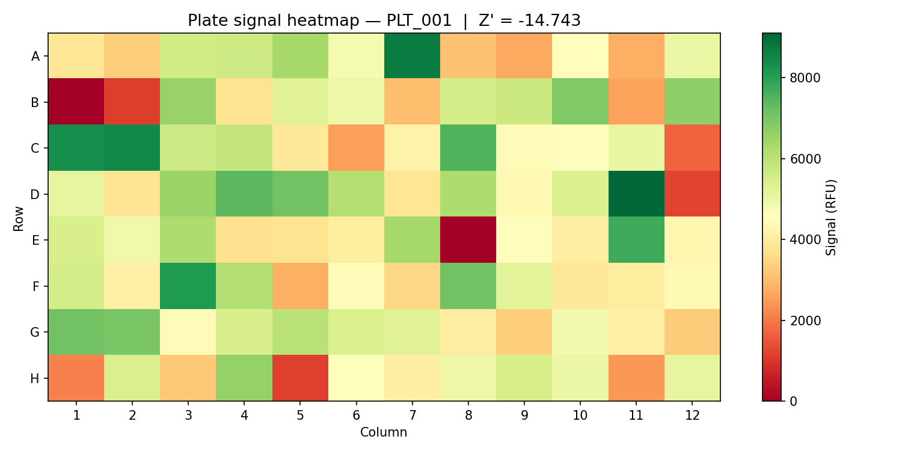
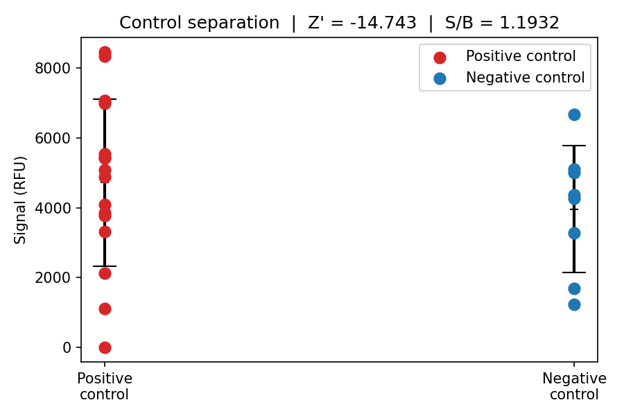
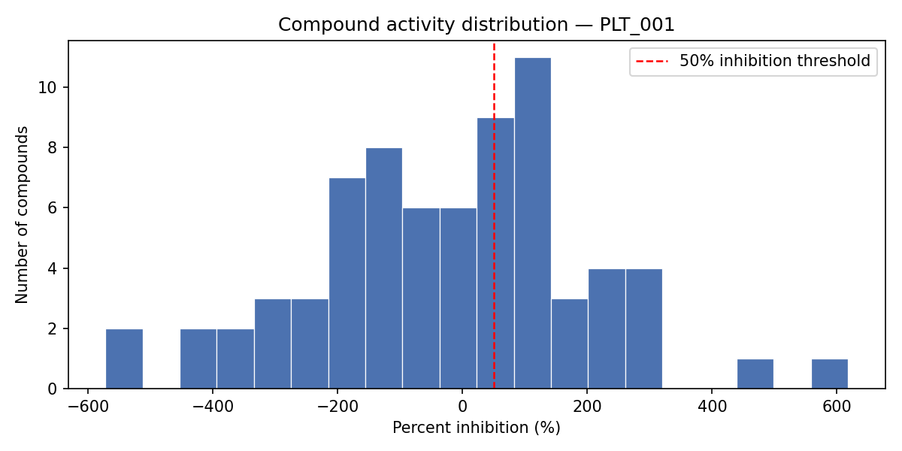

# Merck Bioassay Automation Simulator

A Python simulation of a lab automation pipeline for high-throughput screening (HTS)
in early drug discovery. Built to demonstrate the core engineering patterns used in
bioassay automation labs: device API wrappers, scheduler-driven workflows, structured
traceability logging, QC/normalization, and Genedata-style data export.

This project was built as preparation for a lab automation internship at Merck's
Discovery Pharmacology department in Darmstadt, where interns integrate instruments
into automated workflows and write Python interfaces between devices and scheduling
software.

---

## Why this simulates a real lab automation workflow

In a real HTS lab, a robotic scheduler orchestrates multiple instruments — liquid
handlers, plate readers, stackers, microscopes — passing plates between them
automatically. Every handoff is a structured signal. Every result is logged. Every
plate is QC'd before its data is trusted.

This project reproduces that logic at small scale:

- A **scheduler** reads a JSON job definition and drives execution step by step
- A **device wrapper** (MockPlateReader) exposes a standard interface — `start_run`,
  `get_status`, `fetch_results` — regardless of what vendor protocol sits underneath
- A **handoff signal** (JSON event) is emitted between every step, exactly as a real
  scheduling system would pass state between instruments
- A **QC pipeline** validates every plate before export
- A **traceability log** records every event with timestamps, so failures can be
  diagnosed as automation problems vs biology problems

---

## Architecture

```
scheduler_job_001.json
        │
        ▼
  Scheduler (scheduler.py)
        │  emits: job_received
        ▼
  MockPlateReader (device_api.py)
        │  emits: run_started → run_complete
        ▼
  Raw CSV  (data/raw/plate_reader_output_PLT_001.csv)
        │
        ▼
  QC + Normalization (qc.py / pipeline.py)
        │  emits: qc_complete [passed|failed]
        ▼
  Processed outputs (data/processed/)
        │  ├── qc_report_PLT_001.json
        │  ├── normalized_results_PLT_001.csv
        │  └── genedata_import_PLT_001.csv
        │
        ▼
  MockStacker (device_api.py)
        │  emits: plate_stored
        ▼
  Traceability log (data/logs/run_log.jsonl)
```

One-line summary: `scheduler job → device wrapper → raw results → QC/normalization → Genedata-style export → traceability log`

---

## Project structure

```
merck-bioassay-automation-sim/
├── configs/
│   ├── instrument_config.json   # device registry (IDs, hosts, ports)
│   ├── scheduler_config.json    # retry limits, step timeouts, workflow order
│   └── assay_rules.json         # QC thresholds (Z' > 0.5, S/B > 2.0)
├── data/
│   ├── input/
│   │   ├── plate_map_001.csv         # 96-well layout: well type, compound, conc.
│   │   └── scheduler_job_001.json    # job definition: steps, devices, methods
│   ├── raw/                          # instrument output (generated on run)
│   │   ├── plate_reader_output_PLT_001.csv
│   │   └── plate_reader_output_PLT_TEST.csv
│   ├── processed/                    # QC reports, normalized CSV, Genedata export
│   │   ├── control_separation_PLT_001.png
│   │   └── genedata_import_PLT_001.csv
│   │   ├── inhibition_histogram_PLT_001.png
│   │   └── normalized_results_PLT_001.csv
│   │   ├── plate_heatmap_PLT_001.png
│   │   └── qc_report_PLT_001.json
│   ├── logs/                         # run_log.jsonl + per-event JSON files
│   │   ├── event_JOB_001_plate_stored.json
│   │   └── event_JOB_001_qc_complete.json
│   │   ├── event_JOB_001_read_complete.json
│   │   └── run_log.jsonl
│   └── examples/
│       ├── plate_reader_output_failed_controls.csv   # bad assay window demo
│       └── plate_reader_output_missing_wells.csv     # incomplete plate demo
├── src/
│   ├── models.py        # Pydantic data contracts (WellResult, QCResult, etc.)
│   ├── utils.py         # logger, JSON helpers, timestamp
│   ├── device_api.py    # MockPlateReader, MockStacker
│   ├── scheduler.py     # job execution, handoff signal emission
│   ├── pipeline.py      # orchestrates QC → normalization → export
│   ├── qc.py            # Z'-factor, S/B, percent inhibition, outlier detection
│   ├── reporting.py     # terminal QC summary (Rich)
│   └── main.py          # entry point — runs success + failure scenario
├── tests/
│   ├── test_qc.py        # QC formula correctness
│   └── test_device_api.py
│   └── test_pipeline.py
├── notebooks/
│   └── explore_qc.ipynb  # plate heatmap + percent inhibition histogram
├── images/
│   └── control_separation_PLT_001.png
│   ├── inhibition_histogram_PLT_001.png
│   ├── plate_heatmap_PLT_001.png
└── requirements.txt
└── README.md
```

---

## Input files

**`data/input/plate_map_001.csv`** — defines the 96-well plate layout.

| Column | Description |
|---|---|
| `well_id` | Well position (A01–H12) |
| `well_type` | `positive_control`, `negative_control`, or `compound` |
| `compound_id` | Compound identifier or control label |
| `concentration_um` | Compound concentration in µM |

Layout convention: columns 1–2 = positive controls (high signal), column 12 = negative
controls (low signal), columns 3–11 = test compounds.  Control column positions are
defined in `configs/assay_rules.json` and read directly by the QC module — the config
is the single source of truth for plate layout.

**`data/input/scheduler_job_001.json`** — defines the run sequence:

```json
{
  "job_id": "JOB_001",
  "plate_id": "PLT_001",
  "assay_name": "Kinase_Inhibition_Screen",
  "steps": [
    { "step": 1, "device": "PR_01", "method": "HTRF_Assay" },
    { "step": 2, "device": "ST_01", "action": "store" }
  ]
}
```

---

## QC logic

Every plate goes through a six-step QC check before results are trusted.
A failed plate is logged and flagged — data is not discarded, but scientists
are alerted before acting on hits.

### 1. Missing well check
Expected well count (96) is compared to actual wells in the raw file.
Any shortfall is recorded in `missing_wells`.

### 2. Identify controls by column number
Control wells are identified using column positions defined in `configs/assay_rules.json`
(`positive_control_columns: [1, 2]`, `negative_control_columns: [12]`), not by the
well_type label in the plate map. The config is the single source of truth for plate
layout, which matches how real labs manage assay definitions.

### 3. Control statistics
Mean and standard deviation are computed separately for positive controls
(high signal, no inhibition, columns 1–2, 16 wells) and negative controls (low signal, max inhibition, column 12,
8 wells).

### 4. Z'-factor
The primary HTS assay quality metric, developed by Zhang et al. (1999).

```
Z' = 1 - (3·SD_pos + 3·SD_neg) / |mean_pos - mean_neg|
```

| Z' value | Interpretation |
|---|---|
| > 0.5 | Excellent — assay window is clean |
| 0 – 0.5 | Marginal — proceed with caution |
| < 0 | Failed — controls overlap, plate rejected |

A poor Z' can indicate instrument malfunction, liquid handling errors,
reagent degradation, timing issues, or assay biology problems.

### 5. Signal-to-background ratio
```
S/B = mean_pos / mean_neg
```
Must exceed 2.0. Low S/B means the assay cannot reliably distinguish
active compounds from inactive ones.

### 6. Percent inhibition normalization
Each compound well is normalized relative to plate controls:

```
%inhibition = (mean_pos - signal) / (mean_pos - mean_neg) × 100
```

Convention used in this assay:
- Positive controls (high signal) → ~0% inhibition — full signal, no compound effect
- Negative controls (low signal) → ~100% inhibition — signal abolished, maximum effect
- Active hit compounds → high % inhibition, signal suppressed like negative control

Outliers are flagged by Z-score (threshold: 3.0 SD from compound mean).

---

## Output files

| File | Description |
|---|---|
| `data/raw/plate_reader_output_PLT_001.csv` | Raw per-well RFU signals from reader |
| `data/processed/qc_report_PLT_001.json` | Full QC metrics, pass/fail, failure reasons |
| `data/processed/normalized_results_PLT_001.csv` | All 96 wells with percent inhibition |
| `data/processed/genedata_import_PLT_001.csv` | Compound wells formatted for Genedata import |
| `data/logs/run_log.jsonl` | Append-only structured event log (JSONL) |
| `data/logs/event_JOB_001_*.json` | Individual handoff signal files per step |

---

## How to run

```bash
# 1. Clone and set up environment
git clone https://github.com/YOUR_USERNAME/merck-bioassay-automation-sim
cd merck-bioassay-automation-sim
conda create -n lab-auto python=3.11 -y
conda activate lab-auto
pip install -r requirements.txt

# 2. Run the full pipeline (success + failure scenario)
python -m src.main

# 3. Run tests
# Note: set PYTHONPATH=. if running on Windows
pytest tests/ -v

# 4. Explore results in notebook
jupyter notebook notebooks/explore_qc.ipynb
```

---

## Example: success run

Run 1 uses realistic control separation (pos ~28 000 RFU, neg ~1 000 RFU). The following values are taken directly from the run log (`data/logs/run_log.jsonl`):

```
Z'-factor:            0.92      ✓ excellent (threshold: 0.5)
Signal/background:   26.85x       ✓ excellent (threshold: 2.0x)
Positive control wells: 16       ✓ (columns 1–2, rows A–H)
Negative control wells:  8       ✓ (column 12, rows A–H)
Missing wells:        0          ✓
Outlier wells:        0          ✓
Plate verdict:        PASSED
```

Percent inhibition for test compounds ranged across a realistic distribution,
reflecting variable compound activity in a kinase inhibition screen. Positive
controls measured ~0% inhibition and negative controls ~100% inhibition,
confirming the normalization anchors are correctly set.

---

## Example: failure run — broken controls

Run 2 simulates an instrument or reagent failure where positive and negative
controls produce overlapping signals. The following values are from
`data/processed/qc_report_PLT_001.json`, which is overwritten by the failure
run since both runs share the same plate ID:

```
pos_control_mean:  4 722.74 RFU  (16 wells, columns 1–2)
pos_control_std:   2 315.24 RFU  ← very high — controls are noisy
neg_control_mean:  3 958.10 RFU  ← nearly identical to positive controls
neg_control_std:   1 697.36 RFU
Z'-factor:        -14.743        ✗ failed (threshold: 0.5)
Signal/background:  1.19x        ✗ failed (threshold: 2.0x)
Plate verdict:      FAILED
```

From the traceability log (`data/logs/run_log.jsonl`):
```json
{
  "event": "qc_complete",
  "source": "qc_module",
  "plate_id": "PLT_001",
  "status": "failed",
  "timestamp": "2026-05-12T14:02:34.917437+00:00",
  "details": {
    "z_factor": -14.743,
    "s2b": 1.19,
    "pos_control_wells": 16,
    "neg_control_wells": 8,
    "passed": false,
    "failure_reasons": [
      "Z'-factor -14.743 below threshold 0.5",
      "Signal-to-background 1.19 below threshold 2.0"
    ]
  }
}
```

This is how a lab distinguishes an **automation failure** (robot dropped a
command, wrong volume dispensed) from a **biology failure** (compound is
genuinely inactive). The traceability log preserves the full event chain
— job received, run started, run complete, QC result — regardless of outcome.

### Plate heatmap


Colour scale: green = high signal, red = low signal. In a good run, columns 1–2
(positive controls) should be uniformly green and column 12 (negative controls)
uniformly red, with a visible gradient across compound columns. Here the plate
is a uniform mid-range yellow-green throughout — positive and negative controls
are indistinguishable from each other and from test compounds. The absence of
any column-specific colour pattern is the visual signature of a collapsed assay
window. Z' = -14.743 confirms this numerically.

### Control separation


Positive control mean: 4 722.74 RFU (SD 2 315.24). Negative control mean:
3 958.10 RFU (SD 1 697.36). The separation between means is only 764 RFU —
less than one standard deviation of either population. The two distributions
overlap completely, making it impossible to use them as normalization references.
A scientist seeing this plot would immediately investigate whether the wrong
reagent was dispensed, whether a liquid handler tip failed during control
addition, or whether the assay incubation was interrupted.

### Compound activity distribution


Percent inhibition values for test compounds are scattered far outside the
expected 0–100% range, with values running from approximately -210% to
positive outliers. This happens because the normalization denominator
(mean_pos − mean_neg = 764 RFU) is nearly zero relative to the signal noise,
so small differences in raw signal produce enormous swings in calculated
inhibition. These compound results are meaningless — which is precisely why
the QC step exists and why this plate is rejected before any scientist acts
on the data. In a real campaign, this plate would be re-run after identifying
and resolving the root cause.

---

## Data formats used

| Format | Where | Why |
|---|---|---|
| JSON | Job definitions, configs, QC reports, handoff signals | Human-readable, structured, easy to parse and validate |
| JSONL | Run log (`run_log.jsonl`) | Append-only, one event per line, grep-friendly, load directly into pandas |
| CSV | Plate maps, raw results, normalized output, Genedata export | Universal tabular format across all lab software |
| Pydantic models | In-memory data contracts | Type validation catches malformed data before it reaches downstream systems |

---

## What I learned

- **Device wrapper pattern**: abstracting vendor-specific instrument APIs behind a
  standard Python interface (`start_run` / `get_status` / `fetch_results`) lets the
  scheduler remain agnostic to how each instrument actually communicates — swapping
  a real EnVision reader in for the mock requires changing only the internals of one
  class, not the scheduler or pipeline
- **Config as single source of truth**: control column positions belong in
  `assay_rules.json`, not hardcoded in QC logic. When I initially let the QC code
  rely on `well_type` labels from the plate map rather than column definitions from
  the config, the two fell out of sync silently. Making the config authoritative
  and the code read from it eliminates that class of bug
- **Traceability-first design**: logging every event as structured JSON before
  worrying about business logic made debugging immediate and audit trails automatic.
  The run log is the first place to look when something fails — it shows exactly
  which step emitted a failure and what the values were at that moment
- **Z'-factor in practice**: a Z' of -14.7 does not mean the data is slightly
  unreliable — it means the assay window has completely collapsed and no compound
  result on that plate can be trusted. The high standard deviations (2 315 RFU on
  positive controls) tell the story: the controls themselves are inconsistent, not
  just poorly separated
- **Test assertions must match biological conventions**: two tests initially had
  the percent inhibition expectations reversed — asserting positive controls should
  be near 100% when the formula places them near 0%. Catching this required
  understanding both the math and the biology, not just running the tests

---

## Planned extensions

- `devices/microscope.py` — high-content imaging device wrapper with per-well cell
  feature output (cell count, nucleus intensity, viability index)
- Retry logic in the scheduler for transient instrument errors
- Plate heatmap export as PNG alongside the QC report
- Separate plate IDs for success and failure runs so processed outputs are not
  overwritten between runs
- Second assay type (cellular viability) with different normalization rules